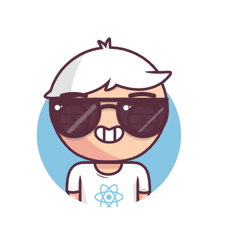

  <pre>
    <code>
 ██████╗ ████████╗ 
██╔═══██╗╚══██╔══╝ 
██║   ██║   ██║    
██║ █ ██║   ██║    
╚████████╝  ██║    
 ╚═════╝██  ╚═╝    
     </code>
  </pre>

 
  
👋 Hey there! Welcome to my GitHub!

